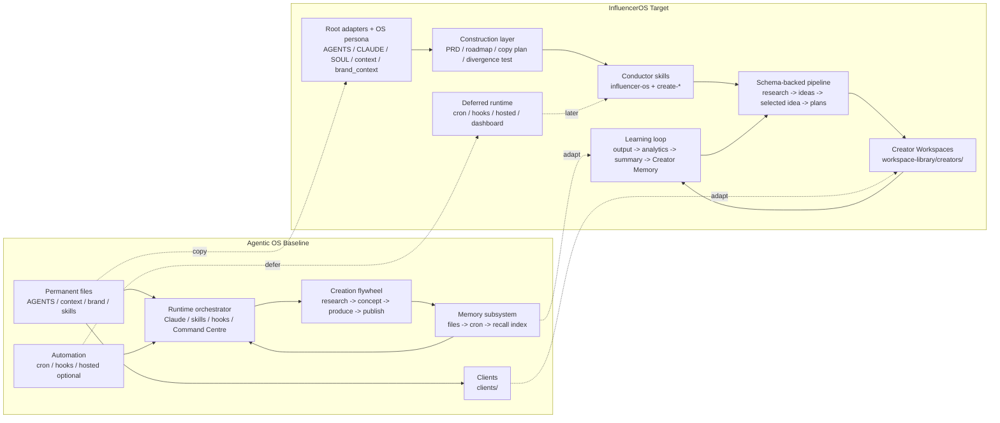

# Agentic OS vs InfluencerOS Architecture Comparison

Last updated: 2026-07-03

Framing reviewed 2026-07-03 (Phase 0C Batch G): the four lanes agree with `agentic-os-copy-plan.md` and the recorded execution decisions. The Excalidraw scene remains optional and pending.

## Purpose

This comparison shows how InfluencerOS copies, adapts, defers, or rejects parts of Agentic OS.

Use it before implementation work that could drift from the Agentic OS reference.

## Map Type

Comparison map with four lanes:

1. **Copy**: patterns InfluencerOS should keep close to Agentic OS.
2. **Adapt**: patterns InfluencerOS keeps but changes for creator-scoped content planning.
3. **Defer**: patterns InfluencerOS may use later but not in v1.
4. **Reject For V1**: patterns that solve the wrong problem for the current phase.

## Visual Status

- Excalidraw scene URL or ID: pending.
- Local screenshot: pending.
- Last visual verification: pending.

## Source Files Inspected

Agentic OS:

- `/Users/ashokaji/code/External repos/Agentic Academy/agentic-os/docs/agentic-os-architecture-map.md`
- `/Users/ashokaji/code/External repos/Agentic Academy/agentic-os/AGENTS.md`
- `/Users/ashokaji/code/External repos/Agentic Academy/agentic-os/docs/context-matrix.md`
- `/Users/ashokaji/code/External repos/Agentic Academy/agentic-os/docs/skill-registry.md`
- `/Users/ashokaji/code/External repos/Agentic Academy/agentic-os/docs/multi-client-guide.md`
- `/Users/ashokaji/code/External repos/Agentic Academy/agentic-os/docs/memory-retrieval.md`

InfluencerOS:

- `docs/os-construction/maps/overall-influencer-os-architecture.md`
- `docs/os-construction/agentic-os-copy-plan.md`
- `docs/os-construction/agentic-os-alignment.md`
- `docs/os-construction/context-matrix.md`
- `docs/os-construction/skill-registry.md`
- `docs/os-construction/prd.md`
- `ARCHITECTURE.md`
- `docs/pipeline-contract.md`
- `docs/provider-boundary.md`
- `docs/adr/0014-first-party-os-persona-and-skill-overrides.md`

## High-Level Verdict

InfluencerOS should copy Agentic OS closely, except where the domain or v1 scope requires a deliberate adaptation.

The shared shape is:

```text
durable files -> orchestrator/skills -> repeatable workflow -> outputs -> feedback -> memory -> better future work
```

The main adaptation is domain: Agentic OS is a general business assistant with multi-client support, Command Centre, cron, hooks, and broad memory. InfluencerOS is a local-first creator content planning OS with schema-backed records, provider gates, creator workspaces, and deferred Command Centre.

## Core Comparison

| Area | Agentic OS baseline | InfluencerOS target | Decision |
| --- | --- | --- | --- |
| Root adapters | `AGENTS.md` canonical, `CLAUDE.md` wrapper, Codex-compatible. | `AGENTS.md`, `CLAUDE.md`, and `SOUL.md` point to the same product docs. | Copy |
| First-party persona | Root `context/` and `brand_context/` hold system/client context. | Root `context/` and `brand_context/` hold InfluencerOS OS persona context. | Copy |
| Client separation | `clients/<slug>/` holds client context, brand, projects, cron, overrides. | `workspace-library/creators/<slug>/` holds creator context, references, projects, memory, overrides. | Adapt |
| Skills | `.claude/skills/{category}-{skill}/` plus registry and context matrix. | Source skills live under repo `skills/<skill>/`; Creator Workspaces receive copied runtime skills under `.claude/skills/<skill>/`. | Adapt |
| Skill overrides | `SKILL.local.md` beside base skills and client copies. | OS-scope overrides may sit beside repo source skills; creator overrides sit beside copied runtime skills under `.claude/skills/<skill>/`. | Copy/adapt |
| Orchestrator | Emergent runtime layer: instructions, skills, hooks, Command Centre, Claude sessions. | Conductor skills plus CLI helpers and schema-backed workflow records. | Adapt |
| Workflow model | Creation flywheel: research, concept, produce, publish, gather data, feedback. | Planning pipeline: research, ideas, selected idea, template, plan, generation plan, output package, learning. | Adapt |
| Outputs | Project folders and deliverables, often markdown-first. | Schema-backed project records and Output Packages with provenance. | Adapt |
| Memory | Tier 0 files, daily logs, `.aos` captures, semantic recall index, cron distillation. | Creator Memory, SQL index, semantic lookup projection; hooks/cron deferred. | Adapt/defer |
| Research | Skills and external providers support research. | Dated Social Research Packs and Video Understanding Packs tied to Creator Profile. | Adapt |
| Provider boundary | External services enhance skills; secrets in `.env`; some workflows call providers. | Provider-backed generation/render/upload/paid calls require exact approval. | Adapt stricter |
| Command Centre | Built app for tasks, cron, memory, docs, skills, settings. | Deferred; CLI/docs/schemas are enough until the file-first OS is stable. | Defer |
| Cron | Markdown job runtime with leader lock and logs. | Deferred until Automation OS. | Defer |
| Hooks | Capture memory, sync sessions, guard branches, update skill locals. | Deferred; hidden automation is too risky before pipeline gates are proven. | Defer |
| Hosted access | Optional hosted memory/team surfaces. | Deferred; local-first is canonical for v1. | Defer |
| Install/update machinery | Installer, updater, client sync, skill add/remove/list scripts. | Not a distribution repo; adopt only copied creator runtime skill sync for v1. | Adapt/defer |
| Visual maps | Has Excalidraw diagram skill and visual operating model. | Has visual map standard and map records under `docs/os-construction/maps/`. | Adapt |

## What We Copy

- Thin root adapters.
- First-party root persona context.
- Brand context as a separate context class.
- Skill registry and context matrix.
- Progressive disclosure.
- `SKILL.local.md` as the local override pattern.
- File-first source of truth.
- Project outputs in predictable places.
- Memory as files plus searchable projections.
- Durable roadmap, progress, and architecture docs.

## What We Adapt

- Clients become creators.
- General brand/business context becomes Creator Profile plus creator `brand_context/`.
- Generic outputs become schema-backed records and Output Packages.
- Broad session memory becomes creator-scoped memory with provenance.
- Research becomes dated, sourced, platform-scoped research per ADR 0020 (Research Runs, Search Plans, Evidence, Source Yield, Findings, Idea Queue), with Social Research Packs retained only as compatibility records and Video Understanding Packs used when real videos are analyzed.
- Provider integrations become explicit approval gates.
- Skill routing becomes conductor skills tied to workflow records.
- Agentic OS flywheel becomes InfluencerOS planning and learning loops.

## What We Defer

- Cron and scheduled workflows.
- Command Centre/dashboard.
- Hooks and automatic memory capture.
- Hosted or anywhere-access execution.
- Platform publishing/scheduling.
- Provider-backed generation runtime.
- Cross-creator learning aggregation.
- Typed subagents (`.claude/agents/`) and slash commands (`.claude/commands/`) — classified in the copy plan (workstream 15); subagent adoption gets its own ADR only when a Phase 1 producer skill reaches for it.

## What We Reject For V1

- Installer/updater machinery for distributing InfluencerOS as a generic Agentic OS package.
- Treating raw analytics as default semantic memory.
- Using "memory palace" as product language.
- Editing core skill files for one creator's local preference.
- Platform-specific adapters as part of the first planning slice.

## Main Architecture Risks

| Risk | Why it matters | Guardrail |
| --- | --- | --- |
| Memory blending | Creator-specific performance lessons could pollute another creator's planning. | Creator Workspaces and creator-scoped memory. |
| Over-copying Agentic OS runtime too early | Command Centre, cron, hooks, and hosted memory could expand scope before the file-first OS works. | Close parity in files, skills, memory, and workflow contracts first; defer Command Centre. |
| Weak provenance | Generic markdown outputs would lose traceability from evidence to plan to artifact. | Schemas, Output Packages, and pipeline contract. |
| Hidden automation | Hooks or cron could cross provider or privacy boundaries. | Explicit provider gate and Automation OS deferral. |
| Skill drift | Local creator needs could corrupt core skills. | `SKILL.local.md` plus promotion rule. |

## Side-By-Side Mermaid Draft

Use this as the first draft for an Excalidraw comparison map.



## Excalidraw Layout Instructions

Use a two-column comparison:

- Left column: **Agentic OS Baseline**.
- Right column: **InfluencerOS Target**.

Use four horizontal rows:

1. Context and permanent files.
2. Orchestrator and skills.
3. Work loop and outputs.
4. Memory, automation, and deferred systems.

Draw relationship arrows between columns:

- green solid arrows for copy,
- blue solid arrows for adapt,
- gray dashed arrows for defer,
- red warning marker for reject in v1.

Keep the visual simple. Put detailed explanations in this Markdown file.

## Open Questions

- Command Centre should appear as part of Agentic OS and as explicitly deferred for InfluencerOS.
- Should the first InfluencerOS implementation issue be Tier 0 creator recall or project folder layout?
- Should the comparison map get its own Excalidraw scene now, or wait until the Agentic OS baseline scene text-rendering caveat is resolved?

## Next Action

Create an Excalidraw comparison scene from this file after the user approves the comparison framing.
