# InfluencerOS Operating Model

Last updated: 2026-07-02

## Purpose

This map translates the Agentic OS operating model into the current InfluencerOS
target structure.

It is meant to be the boundary-first model for implementation: each box names a
deep module, its public contracts, and what it must not own. Use this before
building Planning OS behavior, research schemas, production planning helpers, or
creator memory/indexing.

## Map Type

System architecture and module-boundary map.

This is not a new architecture decision. It adapts the approved Agentic OS map
pattern to the InfluencerOS decisions already recorded in the PRD, roadmap,
architecture map, ADRs, pipeline contract, provider boundary, and creator
workspace structure.

## Visual Status

- Excalidraw scene URL or ID: `1Vrxcm3VDbt`
  (`https://app.excalidraw.com/s/3g0OtZhQ70R/1Vrxcm3VDbt`).
- Local screenshot: `.tmp/influencer-os-operating-model-excalidraw.png`.
- Last visual verification: 2026-07-02; screenshot inspected and key labels
  verified through Excalidraw scene search.
- Renderer caveat: the screenshot renderer dropped text labels, but the scene
  contains editable text and shape labels. Scene search confirmed
  `InfluencerOS Operating Model`, `Public OS Kernel`, `Creator Workspace`,
  `Research and Ideas`, `Idea Promotion Gate`, `Production Planning`,
  `Provider Gate`, `Output Package`, `Learning OS`, `Lookup Projections`, and
  `Deferred or Gated Runtime`.

The Mermaid diagram below is the source draft used for the Excalidraw scene.

## Source Files Inspected

- `AGENTS.md`
- `CONTEXT.md`
- `ARCHITECTURE.md`
- `docs/os-construction/prd.md`
- `docs/os-construction/roadmap.md`
- `docs/os-construction/short-term-plan.md`
- `docs/os-construction/repository-map.md`
- `docs/os-construction/architecture-map.md`
- `docs/os-construction/agentic-os-alignment.md`
- `docs/os-construction/agentic-os-copy-plan.md`
- `docs/os-construction/agentic-os-parity-plan.md`
- `docs/os-construction/divergence-test.md`
- `docs/os-construction/visual-architecture-maps.md`
- `docs/os-construction/context-matrix.md`
- `docs/os-construction/skill-registry.md`
- `docs/creator-workspace-structure.md`
- `docs/pipeline-contract.md`
- `docs/provider-boundary.md`
- `docs/adr/0008-creator-learning-memory.md`
- `docs/adr/0009-schema-first-implementation-order.md`
- `docs/adr/0010-file-first-with-sql-index.md`
- `docs/adr/0011-semantic-lookup-projection.md`
- `docs/adr/0012-project-scoped-content-work.md`
- `docs/adr/0013-creator-setup-readiness-and-reference-lifecycle.md`
- `docs/adr/0015-copied-creator-runtime-skills.md`
- `docs/adr/0016-self-learning-system-skills.md`
- `docs/adr/0017-skill-layout-finalization.md`
- `docs/adr/0018-creator-workspace-propagation-scripts.md`
- `docs/adr/0019-adapter-model-canonical-agents.md`
- `docs/adr/0020-platform-scoped-research-and-idea-queue.md`
- `skills/influencer-os/SKILL.md`
- `schemas/`
- `influencer_os/`

## Operating Thesis

InfluencerOS should not be modeled as one large content pipeline. It should be
modeled as a local-first OS kernel plus creator-scoped deep modules connected by
schema-backed records and explicit approval gates.

The durable source of truth is always the filesystem:

- public repo files hold OS rules, skills, schemas, tests, examples, and product
  architecture;
- ignored Creator Workspaces hold private creator identity, references,
  research, projects, analytics, memory, and local skill overrides;
- SQL and semantic search are rebuildable projections, not canonical stores;
- provider-backed generation, render, upload, paid, or irreversible calls sit
  outside the planning loop until the user approves the exact call or batch.

## Operating Model Diagram

```mermaid
flowchart LR
  subgraph repo["Public OS Kernel - tracked repo"]
    adapters["Root adapters\nAGENTS canonical\nCLAUDE/SOUL thin importers"]
    persona["First-party OS persona\ncontext/ + brand_context/"]
    governance["Architecture governance\nPRD, roadmap, parity plan,\ndivergence test, ADRs"]
    registry["Context matrix + skill registry\nload rules, ownership, overrides"]
    skills["Source skills\nconductor + setup + planned producers"]
    contracts["Contracts and checks\nschemas, examples, tests,\npipeline contract, provider boundary"]
    runtime["Runtime mechanics\nCLI scaffold, sync, validate,\nrun/project helpers"]

    adapters --> governance
    persona --> governance
    governance --> registry
    registry --> skills
    contracts --> runtime
    skills --> runtime
  end

  trigger["Request or approved trigger\nhuman task, research refresh,\nlocal CLI run"]
  orchestrator["Workflow conductor\nskills/influencer-os\nowns sequencing, gates,\nprovenance policy"]

  subgraph creator["Creator Workspace - ignored private root"]
    foundation["Creator Foundation\nworkspace manifest, profile,\nidentity, soul, brand,\nreferences, readiness"]
    research["Research and Ideas\nschedule, intelligence,\nresearch runs, evidence,\nmetric snapshots, findings,\nidea queue"]
    promotion["Idea Promotion Gate\nhuman-approved snapshot\nfrom queue to project"]
    production["Production Planning\nproject, applied template,\nformat-specific plan,\nprovider-neutral generation plan"]
    providerGate["Provider Gate\nexact approval required\nbefore generation/render/upload/paid calls"]
    package["Output Package\nupload-ready core,\nplatform adaptations,\ncreative performance map,\nasset manifest"]
    publication["Publication Evidence\npublished post records,\nmanual/API/CSV analytics snapshots"]
    learning["Learning OS\nperformance summary,\ndistilled lessons,\ncreator memory"]
    index["Local lookup projections\nSQL exact index,\nsemantic decision lookup"]

    foundation --> research
    research --> promotion
    promotion --> production
    production --> providerGate
    providerGate --> package
    package --> publication
    publication --> learning
    learning --> research
    foundation --> index
    research --> index
    package --> index
    learning --> index
  end

  subgraph external["External surfaces - controlled edges"]
    publicSources["Public research sources\nsocial platforms, articles,\nthreads, creator refs"]
    videoInputs["Real video inputs\npublic URLs or local files\nwhen analyzed"]
    providers["Provider adapters\nimage, video, audio,\nrender, upload"]
    finished["Finished products\nplans, output packages,\nmanual publications,\nanalytics records"]
  end

  subgraph deferred["Deferred or gated runtime"]
    commandCentre["Command Centre/dashboard"]
    hooks["Hooks and hidden capture"]
    cron["Cron and automation"]
    hosted["Hosted/anywhere access"]
    publishing["Platform publishing/scheduling"]
  end

  trigger --> orchestrator
  skills --> orchestrator
  contracts --> orchestrator
  runtime --> foundation
  orchestrator --> foundation
  orchestrator --> research
  publicSources --> research
  videoInputs --> research
  providerGate --> providers
  providers --> package
  package --> finished
  publication --> finished

  deferred -. "not v1 unless explicitly approved" .-> orchestrator
```



## Deep Modules

| Module | Owns | Public inputs | Public outputs | Must not own | Primary files |
| --- | --- | --- | --- | --- | --- |
| OS Kernel | Shared operating rules, architecture governance, skill source, schemas, examples, tests, public docs. | Agent runtime starts, architecture work, implementation work. | Canonical instructions, skill source, schema contracts, validation checks. | Real creator identity, private references, generated assets, analytics, secrets. | `AGENTS.md`, `CONTEXT.md`, `ARCHITECTURE.md`, `docs/os-construction/`, `schemas/`, `examples/`, `tests/`, `skills/` |
| Creator Foundation | One creator's local operating root, typed profile, rich identity, brand context, reference library, readiness state. | Intake, interviews, files, reference notes, generated-persona request after review. | Creator Workspace, Creator Profile, runtime context files, Reference Library, setup checklist. | Research findings, idea queue scoring, production plan internals, provider calls. | `workspace-library/creators/<slug>/creator-workspace.json`, `creator-profile.json`, `context/`, `brand_context/`, `references/` |
| Research and Ideas | Platform-scoped research, search planning, evidence, metric snapshots, source-yield learning, rolling findings, research intelligence, scored idea queue. | Creator Profile, schedule, references, public sources, Video Understanding Pack when real videos are analyzed. | Research Findings, Idea Queue entries, queue updates, warnings, promotion candidates. | Creating projects without approval, calling generation providers, burying raw evidence in memory. | `research/`, ADR 0020/0021 schemas, `social-research-pack` compatibility records, `video-understanding-pack` when real videos are analyzed |
| Idea Promotion | The human-approved boundary between research and production. | Queue entry, evidence refs, findings refs, schedule fit, recommended formats/templates. | Idea Promotion record and one or more Project manifests. | Ranking all ideas forever, changing evidence after approval, silent production work. | `schemas/idea-promotion.schema.json`; project `source_refs`; `projects/<project-id>/project.json` |
| Production Planning | Turning an approved idea into a format-specific production plan. | Project, Idea Promotion, creator references, template/structure choice, target format. | Applied Social Template, Micro-Journey/Carousel/Single Image/Story Sequence/Article/Thread plan, Base Video Generation Plan when short-form video needs it. | Provider execution, publishing, analytics interpretation, creator identity changes. | `projects/<project-id>/plan/`, format schemas, `base-video-generation-plan` |
| Output Package | Packaging generated or imported artifacts with provenance and upload-ready materials. | Production plan, approved/imported assets, source refs, packaging decisions. | Output Package, platform adaptations, asset manifest, Creative Performance Map. | Publishing, analytics ingestion, future memory distillation. | `projects/<project-id>/output-package/`, `schemas/output-package.schema.json` |
| Publication Evidence | Registering where an output was published and what measured results exist. | Output Package, platform publication details, API/CSV/manual metric input. | Published Post Record, Analytics Snapshot, raw safe exports. | Inferring missing metrics, semantic memory writes, cross-creator aggregation. | `projects/<project-id>/published/`, `analytics/`, published/analytics schemas |
| Learning OS | Distilling performance evidence into future-useful creator lessons. | Output Package, Published Post Records, Analytics Snapshots, Performance Summary draft. | Performance Summary, distilled creator learnings, Creator Memory updates, indexable summaries. | Raw analytics as default memory, provider calls, project creation. | `performance-summary.md`, `memory/`, `schemas/performance-summary.schema.json` |
| Lookup Projections | Rebuildable query and retrieval layers over creator files. | Creator workspace files, selected summaries, content hashes, record IDs. | SQL exact lookup, semantic decision-support lookup. | Becoming the canonical record store, indexing raw analytics or secrets by default. | `workspace-library/index/influencer-os.sqlite`, `workspace-library/index/semantic/` |
| Runtime Mechanics | Reusable operational mechanics for scaffolding, syncing, validation, and drift checks. | File paths, manifests, records, CLI args. | Created folders, copied runtime skills, validation results, sync reports. | Business decisions, content policy, provider approval decisions. | `influencer_os/cli.py`, `creator_workspaces.py`, `projects.py`, `runs.py`, `validation.py` |
| Provider Boundary | Exact approval for external, paid, generative, upload, render, or irreversible actions. | Provider-neutral plan plus user-approved exact call or batch. | Approved provider call record later; generated/imported asset provenance. | Planning drafts, research summaries, silent provider execution. | `docs/provider-boundary.md`, future provider registry/approval records |

## Boundary Rules

1. OS Kernel files are public product infrastructure; Creator Workspace files are
   private creator state.
2. Creator Foundation can make a creator ready, but it cannot choose production
   direction.
3. Research and Ideas can recommend and score opportunities, but it cannot create
   production work.
4. Idea Promotion is the mandatory human approval boundary between queue state
   and project state.
5. Project folders own the production audit trail after promotion; creator-level
   research and references remain reusable upstream stores.
6. Production Planning may draft provider-neutral prompts and shot plans, but it
   cannot call providers.
7. Output Package owns upload-ready materials and the Creative Performance Map;
   publishing and analytics remain separate evidence records.
8. Raw analytics are evidence, not default memory.
9. Distilled creator learnings must link back to Output Package, Published Post
   Record, Analytics Snapshot, and Performance Summary evidence.
10. SQL and semantic lookup are projections; they must be rebuildable from files
    and scoped by creator.
11. Creator `SKILL.local.md` changes stay creator-local until repeated feedback
    proves the rule belongs in the root skill.
12. Cron, hooks, Command Centre, hosted access, publishing, scheduling, and
    provider adapters remain deferred or gated unless explicitly approved.

## Orchestration Vs Runtime Mechanics

The repo should keep the Agentic OS conductor pattern, but the code should stay
split between orchestration and mechanics.

| Layer | Belongs here | Does not belong here |
| --- | --- | --- |
| Conductor skills | Phase order, domain meaning, approval gates, provenance rules, when to stop and ask. | Folder copying, JSON validation internals, low-level sync details, provider SDK mechanics. |
| Producer skills | Research synthesis, idea queue judgment, template application, production planning, packaging rationale, learning distillation. | Cross-workflow scaffolding, private data deletion, CLI parsing, database/index internals. |
| Runtime helpers | Workspace/project scaffolding, runtime skill sync, schema validation, record path checks, index rebuilds later. | Deciding which idea wins, silently promoting queue entries, approving provider calls, changing creator identity. |
| Provider adapters later | Exact external call mechanics, provider request/response normalization, asset provenance capture. | Deciding that the call is allowed, choosing creative direction, bypassing the provider gate. |

## Implementation Implications

- Build around records, not screen flows. Each module boundary should accept named
  input records and emit one named output record or review artifact.
- Prefer one schema slice per module. ADR 0020 landed Research and Ideas as a
  coherent module, and ADR 0021 added research planning/yield without splitting
  the validation boundary.
- Keep producers narrow. `create-research-findings`, `manage-idea-queue`,
  `promote-idea`, `apply-social-template`, `create-production-plan`, and
  `create-output-package` are better deep modules than one expanded
  `influencer-os` skill.
- Keep CLI helpers mechanical. `init-creator`, `sync-creator-runtime`,
  `init-project`, `validate workspace`, and `validate project` should not encode
  creative judgment.
- Treat the current `ContentIdeaSet` and `SelectedContentIdea` schemas as
  compatibility records only. The target boundary is Research Findings -> Idea
  Queue -> Idea Promotion -> Project.
- Do not design Command Centre around today's helpers. It is a deferred surface
  over the file-first OS, not the core.

## Current Architecture Gaps To Protect

| Gap | Risk | Boundary-safe next move |
| --- | --- | --- |
| Research Intelligence planning/yield records are new. | Agents may browse opportunistically without preserving failed or low-yield attempts. | Keep completed runs blocked on `search-plan.json`, `source-yield.jsonl`, and `sources.json` yield stats. |
| Idea Promotion is now the project entry record. | Future changes could reintroduce deprecated Content Idea Set or Selected Content Idea routing. | Keep project provenance anchored on locked Idea Promotions. |
| `validation.py` uses a hand-rolled JSON Schema subset and hardcoded example list. | Later `$ref`, `oneOf`, and new schema coverage can silently fail. | Complete validator hardening before complex research schemas rely on composition. |
| Learning producer remains planned. | The conductor can imply work that no built skill owns. | Keep machine-actionable dependencies and halt behavior for missing skills. |
| SQL and semantic lookup have accepted ADRs but no DDL/indexer. | Agents may assume recall exists when only files exist. | Sequence exact SQL index before semantic lookup; keep both projections creator-scoped. |
| Excalidraw scene for this model is pending. | Visual consumers may miss the boundary-first map. | Convert this Mermaid draft into an editable scene after review. |

## Agentic OS Divergence Test

```text
Agentic OS divergence test:
- Proposed change: create an InfluencerOS operating model map with module boundaries.
- Agentic OS reference: Agentic OS operating model and visual architecture map pattern.
- InfluencerOS decision: adapt the operating model to creator workspaces, schema-backed records, provider gates, and deferred Command Centre.
- Classification: adaptation.
- Decision record: agentic-os-alignment.md, agentic-os-copy-plan.md, visual-architecture-maps.md, ADRs 0010-0021.
- Status: pass.
```

## Open Questions

- Should the first dedicated follow-up map be Research and Ideas, Production
  Planning, or Creator Workspace boundaries?
