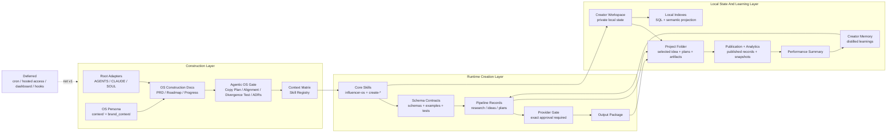

# Overall InfluencerOS Architecture Map

Last updated: 2026-07-01

## Purpose

This map records the target architecture for InfluencerOS as a local-first Agentic OS adaptation.

It should guide the first Excalidraw system diagram and future comparison against the Agentic OS baseline map.

## Map Type

System architecture map with three visual lanes:

1. **Construction Layer**: how the OS is planned, governed, and kept aligned with Agentic OS.
2. **Runtime Creation Layer**: how creators, skills, schemas, and workflow records produce content plans.
3. **Local State And Learning Layer**: where private creator state, output packages, analytics, and memory live.

## Excalidraw Status

- Scene URL or ID: `3RlIvOHxYGz` (`https://excalidraw.com/#json=3RlIvOHxYGz`).
- Local screenshot: `.tmp/overall-influencer-os-architecture-excalidraw.png`.
- Last visual verification: 2026-07-01; screenshot inspected and key labels verified through Excalidraw scene search.
- Renderer caveat: the screenshot renderer dropped text labels, but the scene contains editable text and shape labels. Scene search confirmed `Construction Layer`, `Runtime Creation Layer`, `Creator Workspace boundary`, `Provider Gate`, `Divergence Gate`, `Deferred Runtime Boundary`, `Output Package`, and `Creator Memory`.

## Source Files Inspected

- `AGENTS.md`
- `CLAUDE.md`
- `SOUL.md`
- `README.md`
- `CONTEXT.md`
- `ARCHITECTURE.md`
- `context/`
- `brand_context/`
- `docs/os-construction/prd.md`
- `docs/os-construction/roadmap.md`
- `docs/os-construction/repository-map.md`
- `docs/os-construction/agentic-os-alignment.md`
- `docs/os-construction/agentic-os-copy-plan.md`
- `docs/os-construction/context-matrix.md`
- `docs/os-construction/skill-registry.md`
- `docs/os-construction/divergence-test.md`
- `docs/os-construction/visual-architecture-maps.md`
- `docs/pipeline-contract.md`
- `docs/provider-boundary.md`
- `docs/creator-workspace-structure.md`
- `docs/adr/0014-first-party-os-persona-and-skill-overrides.md`
- `skills/influencer-os/SKILL.md`
- `schemas/`

## Architecture Summary

InfluencerOS has one tracked repo-level operating system and many ignored creator workspaces.

The tracked repo holds:

- root agent adapters,
- first-party OS persona context,
- construction docs,
- schemas,
- examples,
- tests,
- skills,
- workflow contracts,
- provider boundary rules.

Ignored Creator Workspaces hold:

- creator identity and brand context,
- private references,
- research history,
- project records,
- output packages,
- analytics evidence,
- creator memory,
- creator-specific skill overrides.

The system is local-first. Provider-backed work requires explicit human
authorization: exact approval by default, with ADR 0043's one bounded pass over
approved creator-setup reference images.

## Major Nodes

| Node | Role | Key files |
| --- | --- | --- |
| Root adapters | Load the repo rules for different agent contexts. | `AGENTS.md`, `CLAUDE.md`, `SOUL.md` |
| OS persona context | Holds InfluencerOS's first-party voice, positioning, user preferences, and process memory. | `context/`, `brand_context/` |
| OS construction docs | Define what is being built and prevent drift. | `docs/os-construction/` |
| Divergence gate | Blocks silent divergence from Agentic OS. | `agentic-os-alignment.md`, `agentic-os-copy-plan.md`, `divergence-test.md`, `docs/adr/` |
| Skill registry and context matrix | Decide which skills exist and which context each workflow loads. | `skill-registry.md`, `context-matrix.md` |
| Core skills | Orchestrate creator setup and content creation. | `skills/influencer-os/`, `skills/create-*` |
| Schema contracts | Make workflow inputs and outputs deterministic. | `schemas/`, `examples/`, `tests/` |
| Runtime helpers | Initialize and validate local workspaces, projects, and runs. | `influencer_os/` |
| Creator Workspaces | Store private creator state and project artifacts. | `workspace-library/creators/<creator-slug>/` |
| Content creation pipeline | Moves records from creator profile to output package. | `docs/pipeline-contract.md`, project records |
| Provider gate | Stops before generation, render, upload, paid, or irreversible calls. | `docs/provider-boundary.md` |
| Learning OS | Turns publication and analytics evidence into creator-scoped memory. | published records, analytics snapshots, performance summaries, `memory/` |
| Local indexes | Rebuildable query and recall projections over workspace files. | `workspace-library/index/` |
| Deferred systems | Explicitly not part of v1 runtime. | hosted access, cron, Command Centre/dashboard, hooks |

## Primary Flow

```text
Root adapters
  -> OS construction docs
  -> divergence gate
  -> skill registry + context matrix
  -> core skills
  -> schema-backed workflow records
  -> Creator Workspace projects
  -> provider approval gate
  -> Output Package
  -> Published Post Record + Analytics Snapshot
  -> Performance Summary
  -> Creator Memory
  -> future research and idea generation
```

## Mermaid Draft

Use this as the first draft for Excalidraw layout. The Excalidraw version should use editable shapes and arrows, not a pasted image.



## Excalidraw Layout Instructions

Use a left-to-right layout with three horizontal swimlanes:

1. Top lane: **Construction Layer**.
2. Middle lane: **Runtime Creation Layer**.
3. Bottom lane: **Local State And Learning Layer**.

Primary path should be a solid accent arrow:

```text
Root Adapters -> OS Construction Docs -> Divergence Gate -> Context Matrix + Skill Registry -> Core Skills -> Schema Contracts -> Pipeline Records -> Provider Gate -> Output Package
```

Learning loop should be a second accent path:

```text
Output Package -> Publication + Analytics -> Performance Summary -> Creator Memory -> future Research / Idea Generation
```

Use a dashed gray boundary for deferred systems:

```text
cron, hosted access, Command Centre/dashboard, hooks
```

Use warning color only on:

- Provider Gate,
- Divergence Gate,
- Deferred Systems.

Keep labels short in the visual. Use this Markdown file for details.

## Boundaries To Show

| Boundary | Meaning |
| --- | --- |
| Public repo | Tracked source, docs, schemas, examples, tests, skills, and first-party OS persona. |
| Creator Workspace | Ignored local private state for one creator. |
| Provider Boundary | No generation, render, upload, paid, or irreversible external call without exact approval. |
| Agentic OS Divergence Boundary | No architecture divergence without documented decision. |
| Deferred Runtime Boundary | Cron, hosted access, dashboard, and hooks are not v1. |

## Open Questions

- Should the first visual map include the CLI/runtime helper modules, or should those be a separate module map?
- Should first-party OS persona context appear inside the public repo boundary or as a separate persona lane?
- Should the Learning OS loop appear in the overall map, or should it be simplified here and expanded in a dedicated learning map?

## Verification Checklist For Excalidraw

- All primary nodes are readable at desktop zoom.
- Arrows do not cross unrelated nodes.
- Provider Gate and Divergence Gate are visually distinct.
- Creator Workspace is clearly local and private.
- Deferred systems are clearly marked as out of v1.
- Key labels are confirmed through scene search or content readback.
- Screenshot path and scene URL are added to this file.
